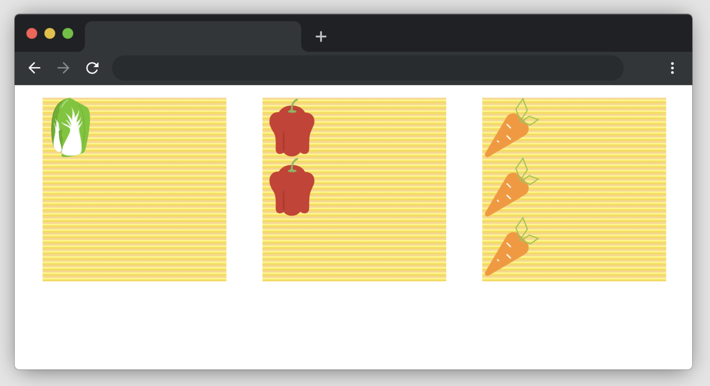
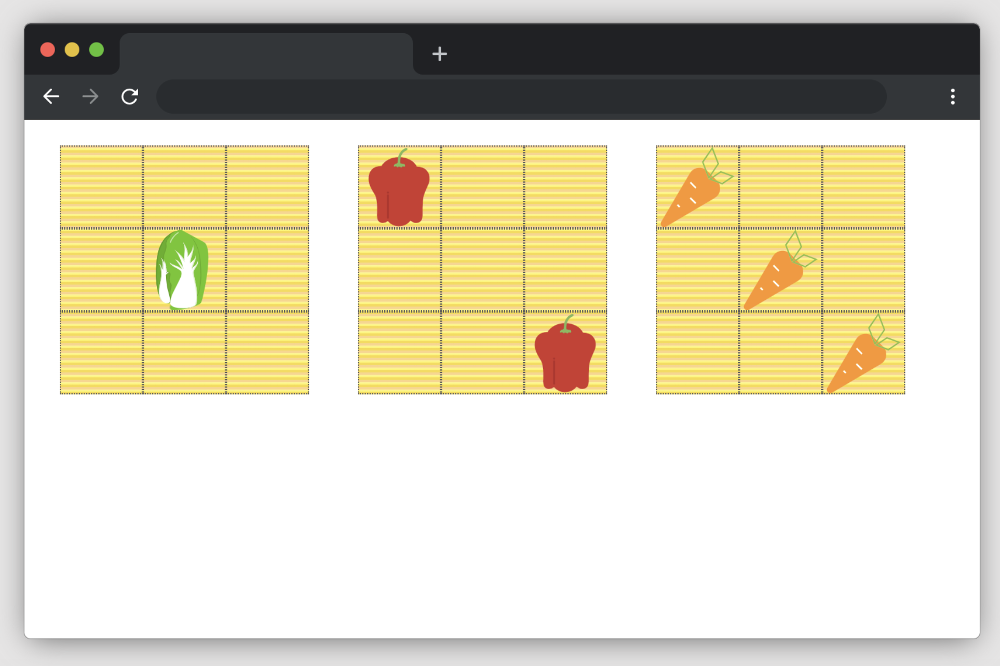

# Fresh Vegetables

To get started, open the editor on the right. You should see two files — `index.html`、`style.css` from your editor. You can see it as follows:

## Requirements

- Please click "Go Live" in the bottom right corner to open port 8080.
- Please complete this challenge in the `style.css` file.
- Please use the various flexbox CSS properties to place the vegetable in the specified position.

## Example

The sizes of all elements will remain unchanged, and the finished effect will look like this (the grey lines in the image are layout reference lines that do not need to be implemented):

