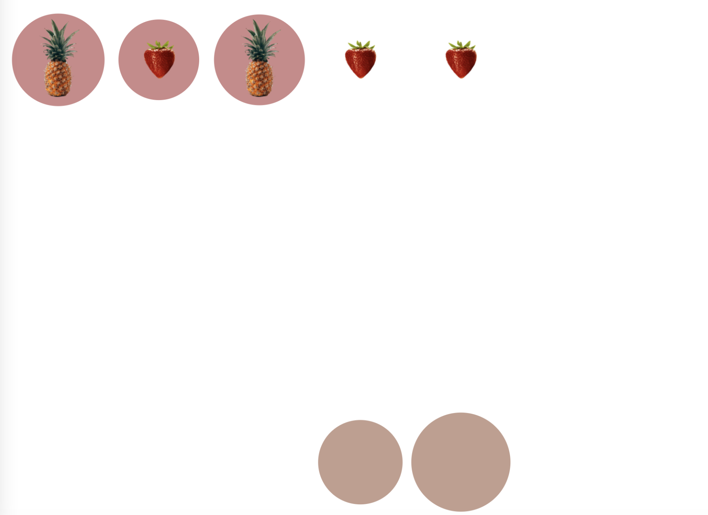
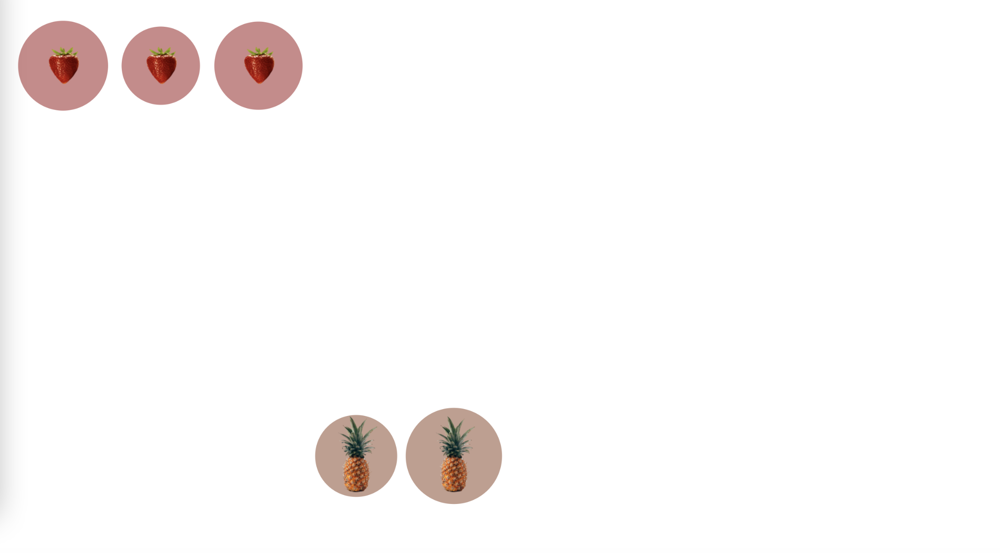

# Fruit Arrangement

To get started, open the editor on the right. You should see two files — `index.html` and `index.css` from your editor. You can see it as follows:



## Requirements

- Please click "Go Live" in the bottom right corner to open port 8080.
- Please complete this challenge in the `index.css` file.
- Please use the `align-self` properties and `order` properties to complete the layout of the page.

## Example

The finished result is as follows:



## Hint

The code in the section you need to modify contains hints, so read them carefully and use `align-self` and `order`in the Flex layout to refine the code in `index.css` to place the appropriate fruit in the appropriate bowl.

```txt
align-self values
  flex-start flex-end flex-centre baseline stretch

order:<integer>(... -1, 0 (default), 1, ...)
```
