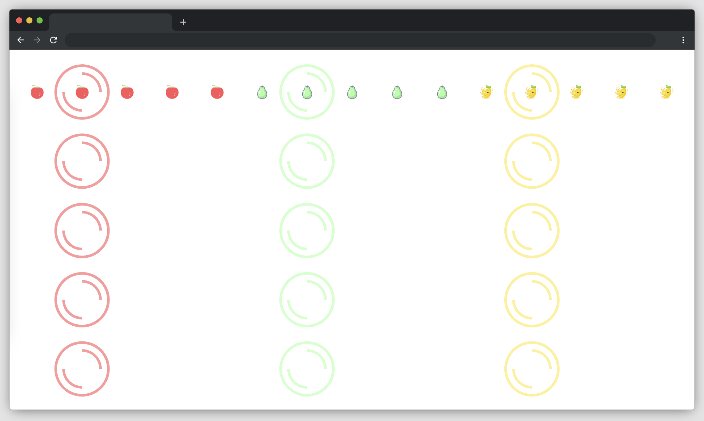
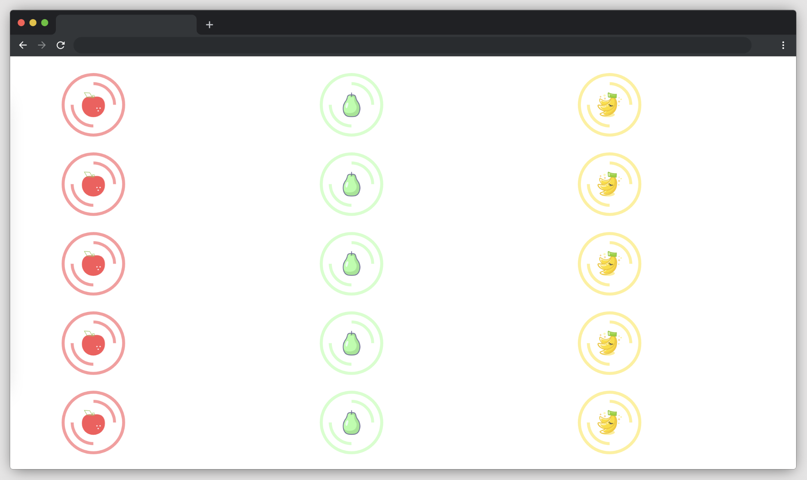

# Fruit Platter

To get started, open the editor on the right. You should see some files — `index.html`、`style.css` and `images` from your editor. You can see it as follows:

## Requirements

- Please click "Go Live" in the bottom right corner to open port 8080.
- Please complete this challenge in the `index.css` file.
- Changing the position of the disc and the size of the image is forbidden.
- Use the `flex` css property to place fruits of the same colour in the middle of a board of the same colour (for example, if the apple is red, place it in the red board).

## Example

The finished result is as follows:

