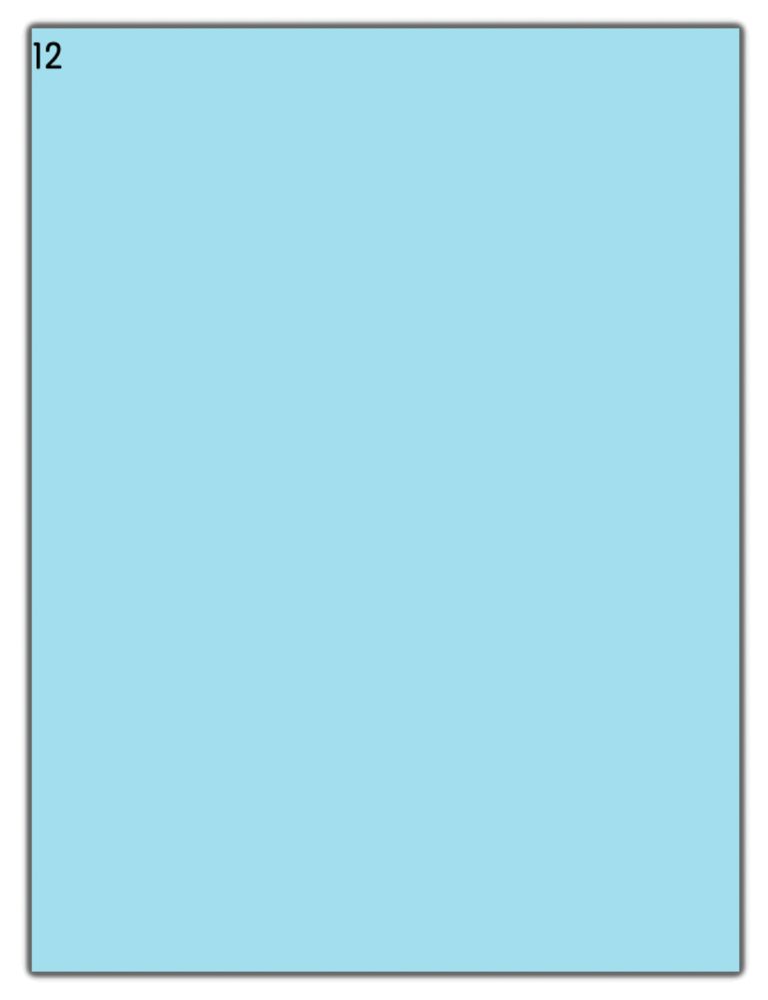

## Unfold Your Fan

To get started, open the editor on the right. You should see two files — `index.html` and `style.css` from your editor.

When previewing the `index.html` page in the browser, the element will not expand when the mouse is over it, the effect will be as follows:

## Requirements

- Please click "Go Live" in the bottom right corner to open port 8080.
- Please complete this challenge in the `style.css` file.
- There are 12 `div` elements of the same size on the page.
- These 12 `div` elements have different background colours.
- The first 6 `div` elements (`id="item1"~id="item6"`) are **counterclockwise** rotated with a **minimum** rotation angle of `10 deg` and a difference of `10 deg` between adjacent elements.
- The next 6 `div` elements (`id="item7"~id="item12"`) are all rotated **clockwise** with a **minimum** rotation of `10 deg` and a difference of `10 deg` between adjacent elements.
- Note that element 6 (`id="item6"`) and element 7 (`id="item7"`), each rotate `10 deg` in the opposite direction, so the angle difference between them is `20 deg`.

## Example

When the mouse s placed over the element, the element expands in a fan shape and the page effect is as follows:

