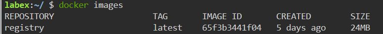
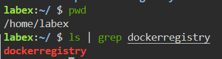
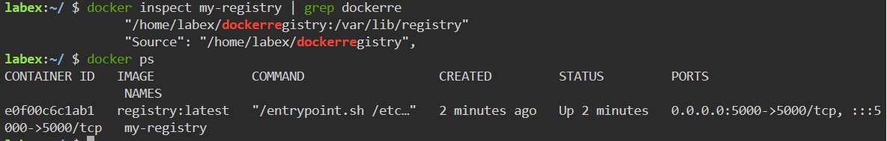

# Setting up a Docker Registry

## Introduction

The step in this challenge will be to set up our local Docker registry. For this, we will utilize the Docker registry image provided by Docker.

## Target

The target of this step is to set up a Docker registry.

## Result Example

Here are the steps to set up a Docker registry:

1. Pull the `registry` image.

2. Create a directory called `dockerregistry` in the `/home/labex` path to make it easier for the container image to persist.

3. Run a container called `my-registry` with the `registry` image, and map port.

4. Use `curl` command to verify that the repository is available.

After completing this step, you will have a running Docker registry instance on your local machine.
