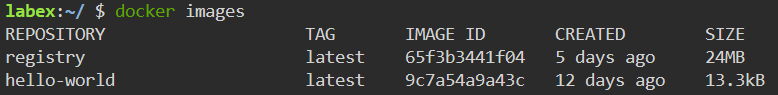
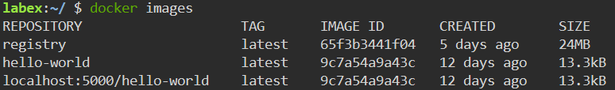
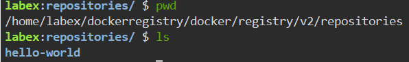

# Pushing an Image to the Docker Registry

## Introduction

Now that our Docker registry is up and running, it's time to see it in action! In this step, we'll take a sample Docker image and push it to our local Docker registry.

## Target

The target of this step is to push an image to our local Docker registry.

## Result Example

Here are the steps to push an image to our local Docker registry:

1. Pull `hello-world` image from Docker Hub.

2. Create a new tag for the `hello-world` image using our registry.

3. Push the `hello-world` image to our registry.

After completing this step, you will have a Docker image pushed to your local Docker registry.
