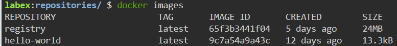
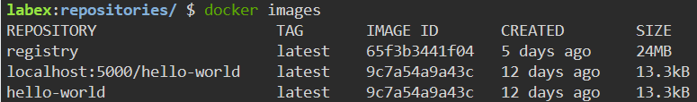
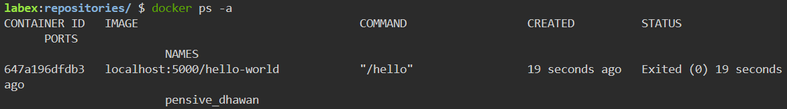

# Pulling an Image from the Docker Registry

## Introduction

The Docker registry is now running and populated with our sample image. In this step, we will demonstrate how to pull an image from our local Docker registry.

## Target

The target of this step is to pull an image from the registry.

## Result Example

Here are the steps to pull an image from your local Docker registry:

1. Use `docker rmi` command to the image that is tagged with `hello-world` image.

2. Pull an image from the your local Docker registry.

3. Run a container for the image you just pulled.

After completing this step, you will have pulled a Docker image from your local registry.
