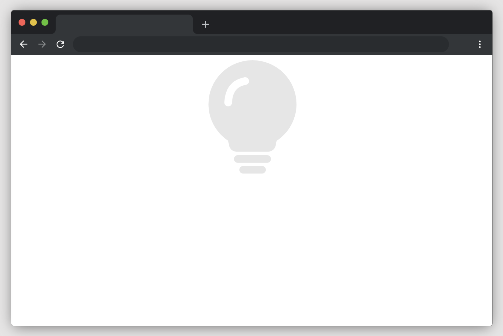

# Colour Changeable Light

To get started, open the editor on the right. You should see two files — `index.html` and `trafficlights.js` from your editor. You can see it as follows:

## Requirements

- Please click "Go Live" in the bottom right corner to open port 8080.
- Please complete this challenge in the `trafficlights.js` file.
- The colour of the light changes to red 3 seconds after the page loads.
- 3 seconds after the light turns red, the light turns green (i.e. the light turns green after 6 seconds). 3.
- The colour does not change again.
- Please display an image of the light in a different colour by changing the 'display' property.

## Example

The finished result is as follows:

