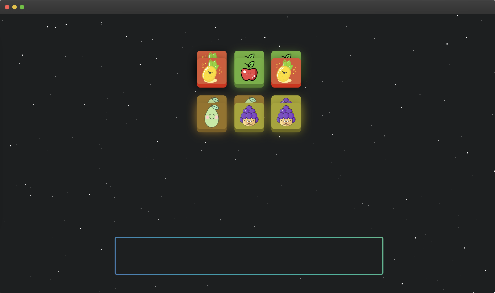
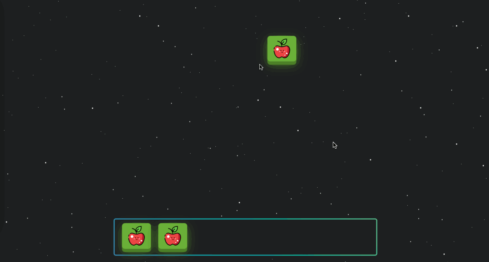

# Fruit Stacker

To get started, open the editor on the right. You should see some files — `index.html`、`style.css`、`jquery.min.js` and images from your editor. You can see it as follows:

Click on the fruit item at the top of the page and the fruit will fall into the grid at the bottom. If there are three identical fruits in the grid, they are automatically eliminated. The maximum number of fruits in the grid is 7. If there are 7 fruits in the grid and they cannot be eliminated, clicking on the fruit at the top will have no effect.

## Requirements

- Please click "Go Live" in the bottom right corner to open port 8080.
- Please use jQuery or js to complete the TODO section of the `index.html` file.
- The animation of the fruit element in the DOM element in `id=card` at the top of the page disappearing on click is already in the code and does not need to be manipulated.
- Each click on the fruit element at the top of the page adds a node for that element to the rectangular box element (`id=box`) at the bottom of the page, and removes the three identical fruit elements from the box element if there are three identical fruit elements in the rectangular box below it.
- If the bottom rectangle (`id=box`) element has 7 fruits and cannot be eliminated, the clicked fruit element node is not in the added rectangle element.

## Example

When you are finished, the final page will look like this:

The eliminatable effect looks like this:

The non-removable effect is as follows:

