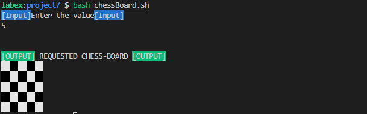

# Chess Board

Write a script to print a chessboard.

## Prerequisites:

- Knowledge about printing colors using `echo`.
- Use of nested loops.
- Script name: `chessBoard.sh`.
- Work directory: `~/project`.

## Objective:

Print colors using `echo` command.

## Requirements:

- To print a black box: `echo -e -n "\\\\[40m" " "`.
- To print a white box: `echo -e -n "\\\\[47m" " "`.
- Call the commands in a loop.
- After 8 columns, return to normal color.
- To return to normal: `echo -e -n "\\\\[0m" " "`.

## Sample Execution / Output:

